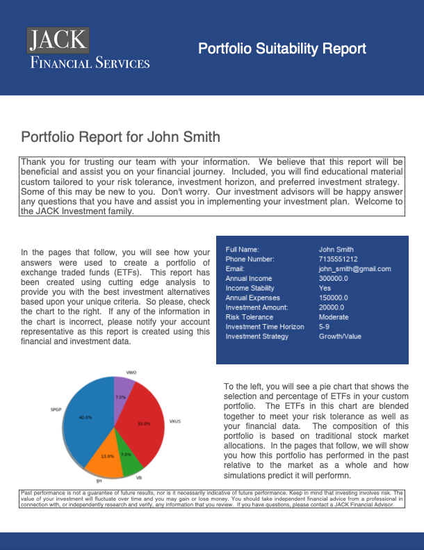
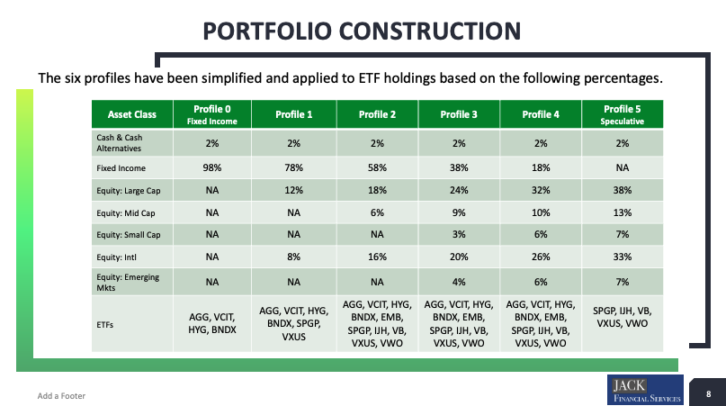
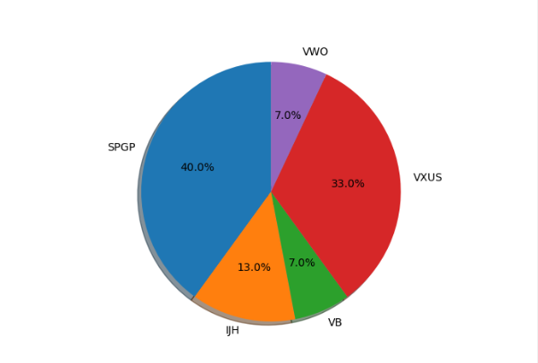
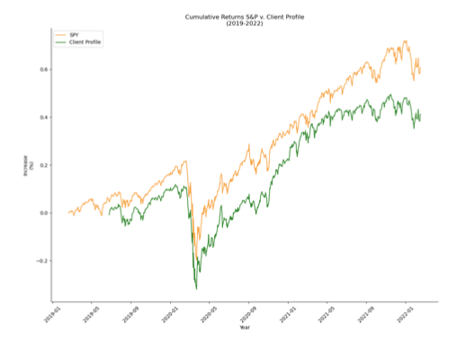
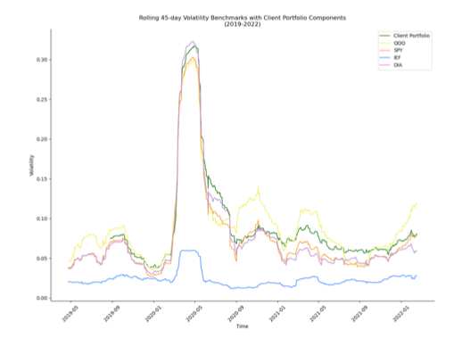
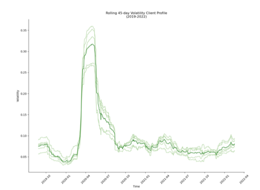
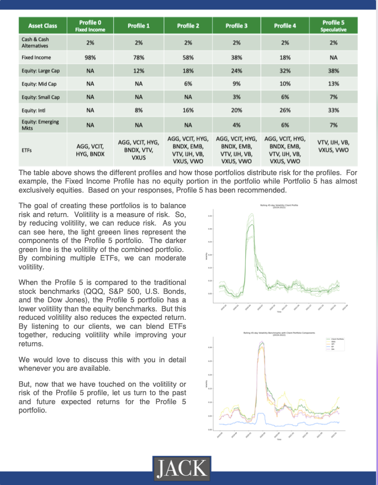
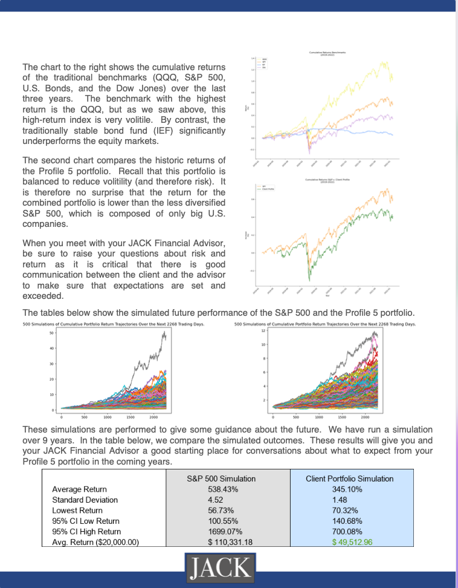

## JACK Financial's Portffolio Suitability Application

One of the most powerful psychological pulls is the urge to reciprocate.  When a person receives a gift, even when it is unrequested or of limited value, the person feels a strong urge to return the favor.  Building on this idea, this Portfolio Suitability Application allows a user to answer a series of questions.  These questions create a customized portfolio plan, composed of multiple ETFs, based upon the potential client's risk tolerance and investing horizon.  Additionally, this report contains graphs and charts that can be the springboard to a demonstration of expertise by the financial advisor.  Most importantly, the application is simple to use.

---

## Technologies

The requirements for running this CLI application are found in the root directory in the file requirements.txt.  These requirements can be installed using the following command.

`pip install -r requirements.txt`

The install will verify that the following are installed in the necessary directory to run the application:

- alpaca_trade_api==1.4.3
- fire==0.4.0
- fpdf==1.7.2
- matplotlib==3.4.3
- numpy==1.20.3
- pandas==1.3.4
- Pillow==9.0.1
- python-dotenv==0.19.2
- python_dateutil==2.8.2
- pytz==2021.3
- questionary==1.10.0

In addition to these libraries, you will need to have a .env file containing your alpaca key and your alpaca secret key.  An explanation for creating an installing a .env file is beyond the scope of this README file, but can be found [here](https://www.youtube.com/watch?v=7LFLV8VsN9o).  You can obtain your alpaca keys [here](https://alpaca.markets).

## CLI Application Launch and Use

Once the above are installed, your .env file is created that contains your alpaca keys, navigate to the directory containing the app.py file and enter the following:

`python app.py`

Once you have launched the application, you will be welcomed with the following message:

---

After launch, the user will be asked a series of questions about their personal information, their financial information, and their investing experience and preferences.  

SHOW OUT PUT PDF

## Backend Tools

## Financial details

The app uses 6 profiles that are simplified versions of profiles created by RBC Wealth Management.
The RBC Welath Management Model: !(Resources/RCC_wealth_mgt_model.png)

ETFs are mapped to the 6 profiles using the risk percentages provided by RBC.
RBC percentages mapped to ETFs: (input graph link)

ETFs were chosen by xxxx

#Overview - technology
This app (portfolio_suitability.ipynb) uses python, pandas and various libraries to collect data, process data, create graphs and develop a pdf.
Market data is pulled into the app using the Alpaca API.
User information is gathered through a CLI leveraging questionary.
The monte carlo simulations are done using MCForecastTools.py
The pdf is developed using FPDF

Please note: the pdf functionality does not work in Jupyter Notebook. We recommend Visual Studio.
Please note: You must create your own Alpaca account and related .env file for this app to function.

#The following libraries and imports are required:

'''
import os
import requests
import json
import pandas as pd
from dotenv import load_dotenv
import alpaca_trade_api as tradeapi
from fpdf import FPDF
from MCForecastTools import MCSimulation
from pathlib import Path
%matplotlib inline
# from mailer import Mailer
import questionary
import fire
from questionary.constants import NO, YES, YES_OR_NO
import sqlalchemy
import hvplot.pandas
'''

#Technical details
Please note: the pdf functionality does not work in Jupyter Notebook. We recommend Visual Studio.

Create a database: sqlite is used to create a local database to hold data input by the user

Gather user data: The user inputs client data into a CLI using questionary technology stored in the
questionary_info.py file. This file is modularized and called into the main app. Questionary asks the following questions:
            What is your name?
            What is your phone number?
            What is your email address?
            What’s your annual income?
            How many years of investing experience do you have?
            What is the amount you want to start investing?
            What are your annual expenses?
            Is your source of income stable?
            What is your level of risk? (Low, Moderate, High, Speculative)
            What do you want to do with this investment? (Income, Growth, Value, Income/ Growth, Income/ Value, Growth/ Value, Income/Growth/ Value)
            How long do you plan to invest the money in years?

Getting Market Data: Using keys stored in a .env file, the app connect to Alpaca and pulls market data for ETFs. Please note: You must create your own Alpaca
account and related .env file for this app to function.

Cleaning Market Data:

Calculate a risk score:

Matching etfs to portfolios:

Calculate daily returns and cumulative returns

Run monte carlo simulations

Create graphs

Create pdf report

#created by
This app is brought to you by Jack Investments founded by Charles Brown, Jacob Burnett, Kevin Gross, Ann Howell
"We are with you however the market moves."

#License
MIT

---

## Technologies

This application runs in a Jupyter Notebook.  

It imports:
- os
- requests
- json
- pandas
- dotenv
- alpaca_trade_api
- MCForecastTools 
- matplotlib

---

## Installation Guide

To properly run this application, you must have MCForecastTools.  Additionally, you will need a .env file containing credentials for Alpaca.  If you do not have credentials, visit *[Alpaca Markets](https://alpaca.markets)*. Otherwise, this software does not require installation.  Simply navigate to the appropriate directory in your terminal and launch a Jupyter Notebook.  Then open the file called financial_planning_tools.ipynb.

---

## Usage

The application begins by accepting a variable for the total number of cryptocurrencies in the member's portfolio.

After pulling the current price of Bitcoin and Ether, the application calculates the total value of the member's cryptocurrency holdings.

Next, the applications accepts the amount of stock the member holds.  Here, the stocks held are a stock etf (SPY) and a bond etf (AGG).

The application then pulls the current (or last) closing price for the stocks.

It then calculates the total current value of the member's portfolio.

The overall weight of the portfolio components is presented in pie chart form.

That number is then used, along with the member's monthly budget to evaluate whether the member has an adequate emergency fund.

From there, the application runs a Monte Carlo simulation and presents the results in two forms: a line graph and a distribution graph.  Here are the results of a 30-year and a 10-year simulation.

---

## Contributors

This project was created as a part of the Rice FinTech Bootcamp.

---

## License

This software is licensed for use under the included MIT License.
